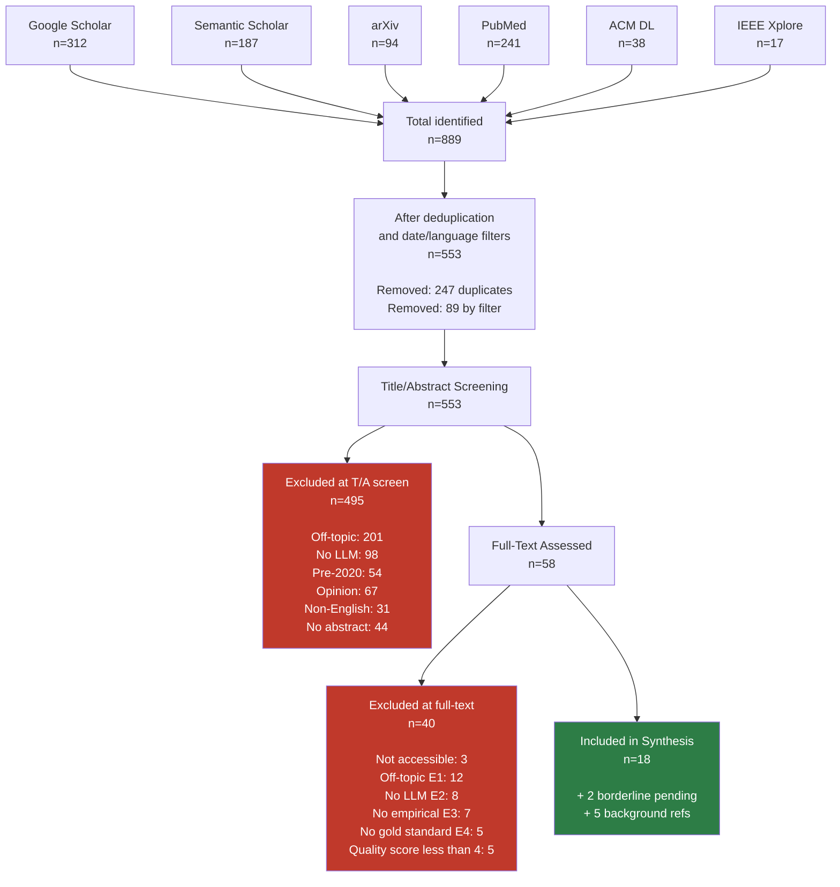

# PRISMA 2020 Flow Diagram

**Project:** LLM-Assisted Literature Screening  
**RQ:** RQ-001-llm-screening.md  
**Last Updated:** 2026-05-25  
**Standard:** PRISMA 2020 (Page et al., 2021)

---

## Record Counts by Stage

| Stage | Count | Notes |
|---|---|---|
| Records identified — Google Scholar | 312 | Iterations 1–3 combined; before deduplication |
| Records identified — Semantic Scholar | 187 | Iterations 1–3 combined; before deduplication |
| Records identified — arXiv | 94 | Iterations 2–3; cs.CL, cs.IR, cs.AI categories |
| Records identified — PubMed | 241 | Iterations 2–3; tiab search |
| Records identified — ACM Digital Library | 38 | Iteration 3 |
| Records identified — IEEE Xplore | 17 | Iteration 3 |
| **Total records identified** | **889** | Sum across all sources before deduplication |
| Records removed (duplicates) | 247 | Same paper found in multiple databases; kept highest-quality metadata version |
| Records removed (automated filter) | 89 | Pre-2020 by date filter; non-English by language filter |
| **Records after deduplication and filtering** | **553** | Entered title/abstract screening |
| Records excluded (title/abstract screen) | 495 | Reasons below |
| **Records assessed for full-text eligibility** | **58** | Passed title/abstract screen |
| Records excluded (full-text, not accessible) | 3 | Paywalled; no open version found |
| Records excluded (full-text, off-topic E1) | 12 | Clinical screening, not literature screening |
| Records excluded (full-text, no LLM component E2) | 8 | Rule-based or classical ML only |
| Records excluded (full-text, no empirical eval E3) | 7 | Opinion, commentary, framework only |
| Records excluded (full-text, no human comparison E4) | 5 | LLM evaluated without gold standard |
| Records excluded (full-text, low quality score <4) | 5 | Quality rubric score below threshold |
| **Records included in synthesis** | **18** | Quality score ≥7; 2 borderline pending second review |

---

## Reasons for Exclusion at Title/Abstract Stage

| Reason | Count |
|---|---|
| Off-topic (clinical screening, product reviews, etc.) | 201 |
| No LLM component (keyword-based or classical ML only) | 98 |
| Pre-2020 (outside date scope) | 54 |
| Opinion/editorial/perspective (no empirical content evident from abstract) | 67 |
| Non-English abstract | 31 |
| Insufficient abstract to judge (abstract not available) | 44 |
| **Total excluded at T/A stage** | **495** |

---

## ASCII Flow Diagram

```
+------------------------------------------------------------------+
|              IDENTIFICATION                                       |
+------------------------------------------------------------------+
|                                                                   |
|  Google Scholar   Semantic Scholar   arXiv   PubMed   ACM   IEEE |
|      n=312            n=187           n=94   n=241   n=38  n=17  |
|                                                                   |
|                     Total identified: n=889                       |
+------------------------------------------------------------------+
                              |
                              v
+------------------------------------------------------------------+
|              DEDUPLICATION AND FILTERING                          |
|                                                                   |
|  Duplicates removed:       n=247                                 |
|  Automated filters:        n=89  (date, language)               |
|                                                                   |
|                     After filtering: n=553                        |
+------------------------------------------------------------------+
                              |
                              v
+------------------------------------------------------------------+
|              TITLE / ABSTRACT SCREENING                           |
|                                                                   |
|  Screened:                 n=553                                 |
|  Excluded:                 n=495 (reasons above)                 |
|                                                                   |
|                     Passed to full-text: n=58                     |
+------------------------------------------------------------------+
                              |
                              v
+------------------------------------------------------------------+
|              FULL-TEXT ELIGIBILITY ASSESSMENT                     |
|                                                                   |
|  Assessed:                 n=58                                  |
|  Excluded:                 n=40                                  |
|    - Not accessible:        3                                     |
|    - Off-topic (E1):       12                                     |
|    - No LLM (E2):           8                                     |
|    - No empirical (E3):     7                                     |
|    - No gold standard (E4): 5                                     |
|    - Quality score <4:      5                                     |
|                                                                   |
|                     Included in synthesis: n=18                   |
|                     Borderline (pending):   n=2                   |
+------------------------------------------------------------------+
                              |
                              v
+------------------------------------------------------------------+
|              INCLUDED IN SYNTHESIS                                |
|                                                                   |
|  Final included:           n=18  (quality score 7-10)            |
|  Background references:     n=5  (cited but not in matrix)       |
|                                                                   |
+------------------------------------------------------------------+
```

---

## Mermaid Flowchart



---

## Stage Notes

### Identification
- All searches completed between 2026-05-10 and 2026-05-22 (Iterations 1-3)
- Fourth iteration (bioRxiv) not yet complete; will update counts when done
- Full search log: `search/search_log.csv`

### Deduplication
- Primary deduplication by DOI; secondary by arXiv ID; tertiary by title+year fuzzy match (Levenshtein distance <5)
- When duplicate found: kept the version with the most complete metadata (typically Semantic Scholar or ACM DL)
- Preprint + published version pairs: kept published version; linked arXiv ID in `library/papers_manifest.csv`

### Title/Abstract Screening
- Screened by one researcher; no second screener at T/A stage (conservative approach — uncertain papers passed to full-text)
- "No abstract available" papers: retrieved via DOI and abstract added manually where possible; 44 could not be resolved

### Full-Text Assessment
- All 58 papers retrieved in full; 3 could not be obtained (logged in `library/papers_manifest.csv` as `full_text_available=FALSE`)
- Quality scoring applied per rubric in `screening/inclusion_exclusion.md`
- Two borderline papers (score 5-6) sent for second review; not yet included in the n=18 count

### Included in Synthesis
- 18 papers entered the evidence matrix (`evidence/evidence_matrix.csv`)
- 5 additional papers retained as background references (score >=4 but outside strict inclusion criteria)
- All 18 included papers have note files in `notes/`

---

## PRISMA Checklist Items Addressed

| PRISMA Item | Location in This Project |
|---|---|
| Search strategy for each database | `search/query_bank.md` |
| Dates of each database search | `search/search_log.csv` |
| Full search string for one database | `search/query_bank.md` — PubMed section |
| Inclusion/exclusion criteria | `screening/inclusion_exclusion.md` |
| Selection process (who screened) | `screening/inclusion_exclusion.md` — Decision Protocol |
| Screening table with decisions | `screening/screening_table.csv` |
| Reasons for exclusion at full-text | This document — full-text exclusion table |
| Characteristics of included studies | `library/papers_manifest.csv` |
| Risk of bias assessment | `screening/inclusion_exclusion.md` — quality rubric |
| Synthesis method | `synthesis/argument_map.md` (when complete) |

---

*Based on: Page MJ et al. The PRISMA 2020 statement. BMJ 2021;372:n71. doi:10.1136/bmj.n71*
